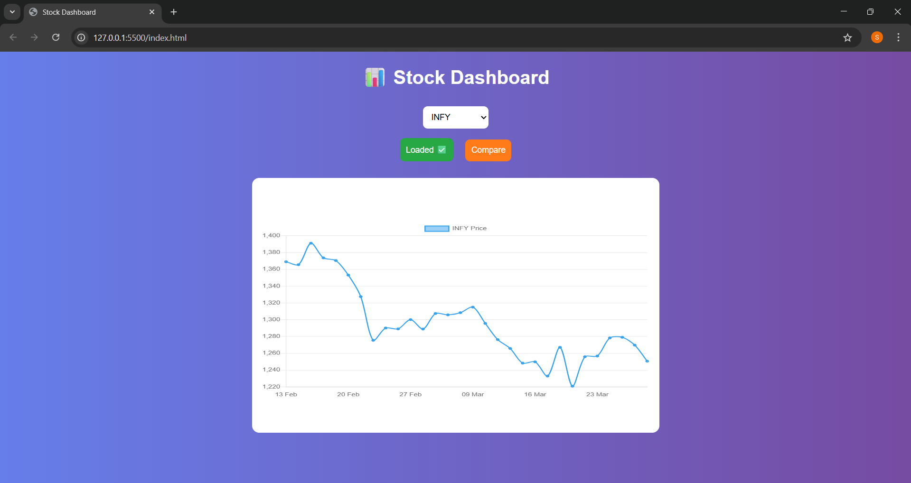
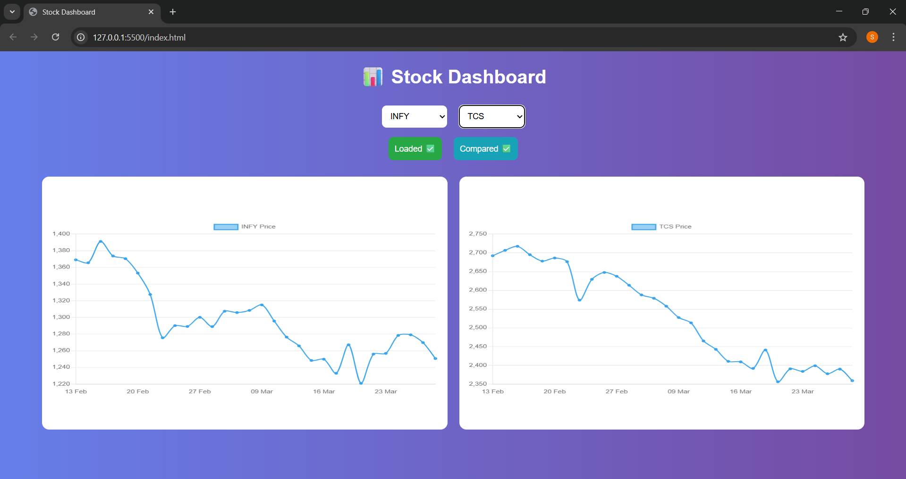

# 📊 Stock Data Intelligence Dashboard

## 🚀 Overview

This project is a mini financial data platform that fetches, processes, and visualizes stock market data. It demonstrates backend API development, data analysis, and frontend visualization.

The application allows users to:

* View stock data for selected companies
* Analyze key metrics like daily returns and moving averages
* Visualize stock trends using interactive charts

---

## 🎯 Features

* 📥 Fetch stock data using **yfinance**
* 🧹 Data cleaning and preprocessing using **Pandas**
* 📈 Calculate:

  * Daily Return
  * 7-day Moving Average
  * 52-week High & Low
* 🔗 REST APIs using **FastAPI**
* 📊 Interactive chart visualization using **Chart.js**
* ⚡ Fast performance using local CSV storage

---

## 🛠️ Tech Stack

### Backend

* Python
* FastAPI
* Pandas
* yfinance

### Frontend

* HTML
* JavaScript
* Chart.js

### Database

* CSV (local storage)

---

## 📁 Project Structure

```
stock-analysis/
│
├── main.py              # FastAPI backend
├── data.ipynb           # Data collection & preprocessing
├── INFY.NS.csv
├── TCS.NS.csv
├── RELIANCE.NS.csv
├── index.html           # Frontend dashboard
├── requirements.txt
└── README.md
```

---

## ⚙️ Installation & Setup

### 1. Clone the repository

```
git clone <your-repo-link>
cd stock-analysis
```

### 2. Install dependencies

```
pip install -r requirements.txt
```

### 3. Run FastAPI server

```
uvicorn main:app --reload
```

### 4. Open frontend

* Open `index.html` in browser (Live Server recommended)

---

## 🔗 API Endpoints

### 📌 Get Companies

```
GET /companies
```

### 📌 Get Stock Data (Last 30 Days)

```
GET /data/{symbol}
Example: /data/TCS
```

### 📌 Get Summary

```
GET /summary/{symbol}
Example: /summary/INFY
```

### 📌 Get Compare

```
GET /compare/{symbol}/{symbol}
Example: /compare/INFY/TCS
```

---

## 📊 Sample Output

* Stock price trends displayed as line charts
* Moving average comparison
* JSON-based API responses

---

## Dashboard Preview



## Comparison 


## 💡 Key Learnings

* Handling real-world financial data
* Building REST APIs using FastAPI
* Data cleaning and feature engineering
* Frontend-backend integration
* Debugging and error handling

---


## 👩‍💻 Author

Shrija

---

## ⭐ Conclusion

This project demonstrates end-to-end development of a financial dashboard combining data engineering, backend APIs, and frontend visualization.
